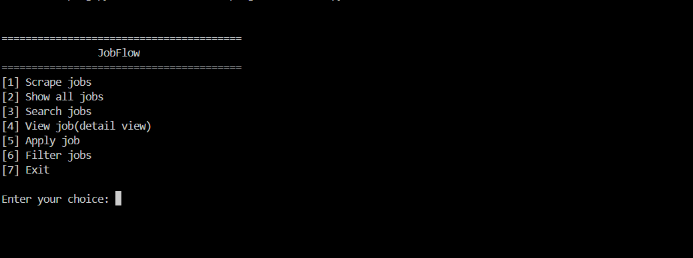
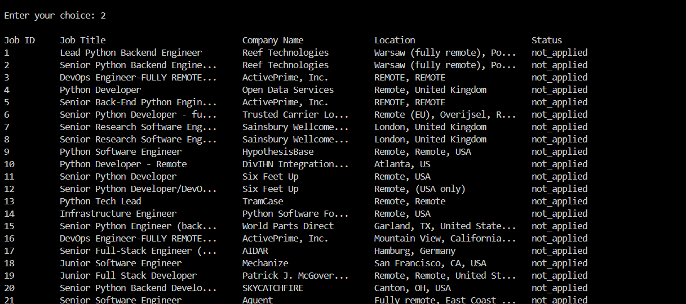

# JobFlow 
A CLI-based job tracking system that scrapes jobs from multiple sources and helps manage your application workflow.

---

## Features
- Scrape jobs from:
   - python.org (BeautifulSoup)
   - RemoteOK (API)
- Store jobs locally using JSON
- Search jobs by keyword (title, company, location, source)
- Filter jobs:
   - Applied
   - Not Applied
- View detailed job information
- Open job links directly in browser
- Track application status

---

## How it works
1. Scrape jobs from multiple sources
2. Store them in a local JSON file
3. Use CLI menu to:
   - View jobs
   - Search/filter
   - Apply & track status

---

## Usage
Run the program:

```bash
python cli.py
```

---

## Project Structure
```

jobflow/
├── cli.py        # CLI interface (menu + input)
├── scraper.py    # Data collection (APIs + scraping)
├── manager.py    # Core logic (search, filter, apply,view)
├── utils.py      # Helper functions (JSON handling, IDs)
├── jobs.json     # Local data storage (ignored in repo)
```
---

## Tech Stack
- Python
- BeautifulSoup
- Requests
- JSON
- Webbrowser

---

## Key Highlights
- Combines web scraping and API integration
- Built as a complete workflow system,not just a scraper
- Focus on clean structure and user interaction

---

## Screenshots

### Menu

### Job List



