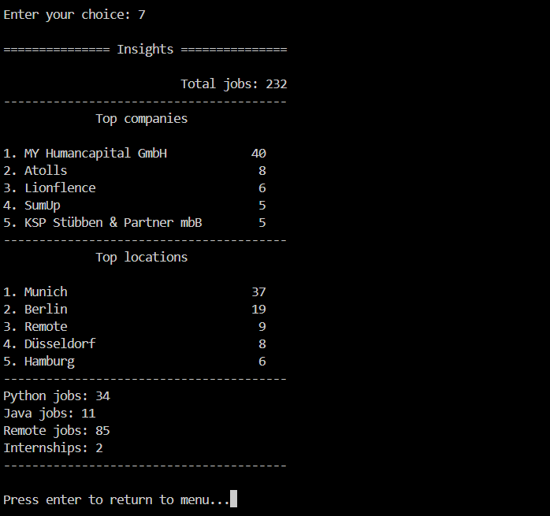

# JobFlow 
A command-line tool that collect job listings that collects job listings from multiple sources and help manage them in one place.
It allows you to search jobs,filter them,track application status,and view useful insights such as top companies,locations,and skill demand.

---

## Features
- Scrape jobs from:
   - python.org (BeautifulSoup)
   - RemoteOK (API)
   - Arbeitnow (API)
- Store jobs locally using JSON
- Search jobs by keywords (title, company, location, source,description)
- Filter jobs:
   - Applied
   - Not Applied
- View detailed job information
- Open job links directly in browser
- Track application status
- View insights:
   - Total jobs
   - Top companies
   - Top locations
   - Skill-based job counts
   - Remote jobs
---

## How it works
1. Scrape jobs from multiple sources
2. Store them in a local JSON file
3. Use CLI menu to:
   - View jobs
   - Search/filter
   - Apply & track status

---

## Usage
Run the program:

```bash
python cli.py
```

---

## Project Structure
```

jobflow/
├── cli.py        # CLI interface (menu + input)
├── scraper.py    # Data collection (APIs + scraping)
├── manager.py    # Core logic (search, filter, apply,view)
├── analysis.py   # pandas functions (insights)
├── utils.py      # Helper functions (JSON handling, IDs)
├── jobs.json     # Local data storage (ignored in repo)
```
---

## Tech Stack
- Python
- BeautifulSoup
- Requests
- Pandas
- JSON
- Webbrowser

---

## Key Highlights
- Combines web scraping and API integration
- Built as a complete workflow system,not just a scraper
- Focus on clean structure and user interaction

---

## Screenshots

### Menu

### Job List



